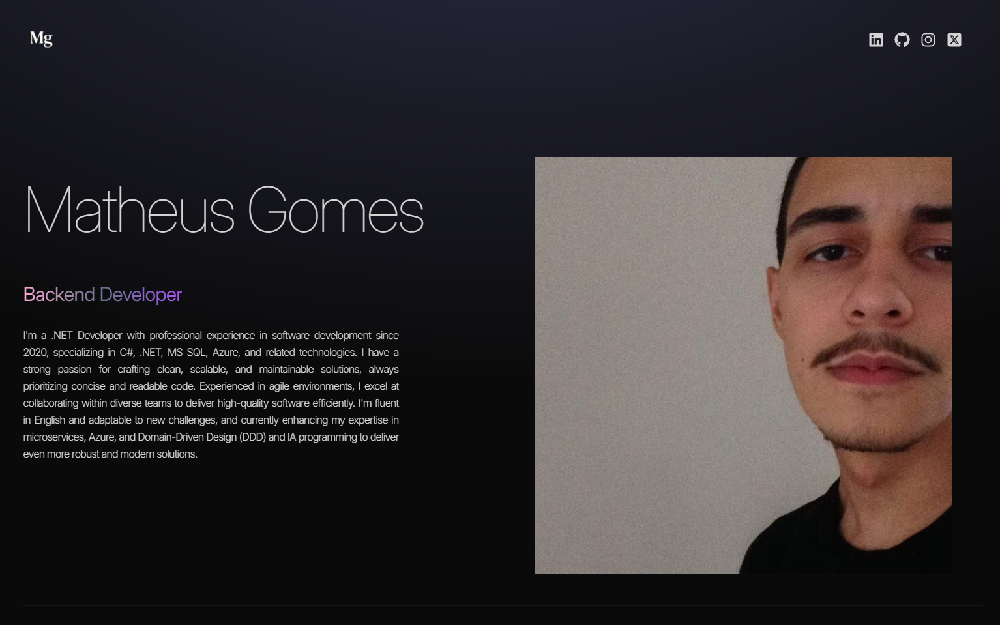

# 🚀 Matheus Gomes - My Portfolio Website

This is my **personal portfolio** built with modern web technologies, showcasing my projects, skills, and experience as a **.NET Backend Developer**.

## 🌍 Live Demo
🔗 [Visit My Portfolio](https://portfolio-matheus-miranda-torres-gomes-projects.vercel.app/)  



## 🛠 Technologies Used

- **Frontend:** React, TypeScript, TailwindCSS, Framer Motion  
- **Deployment:** Vercel  
- **Other Tools:** ESLint, Prettier  

## 🏗 Installation & Running Locally

To run this project locally, follow these steps:

```bash
# Clone the repository
git clone https://github.com/mudouasenha/portfolio.git

# Navigate to the project directory
cd portfolio

# Install dependencies
npm install  # or yarn install

# Start the development server
npm run dev  # or yarn dev
