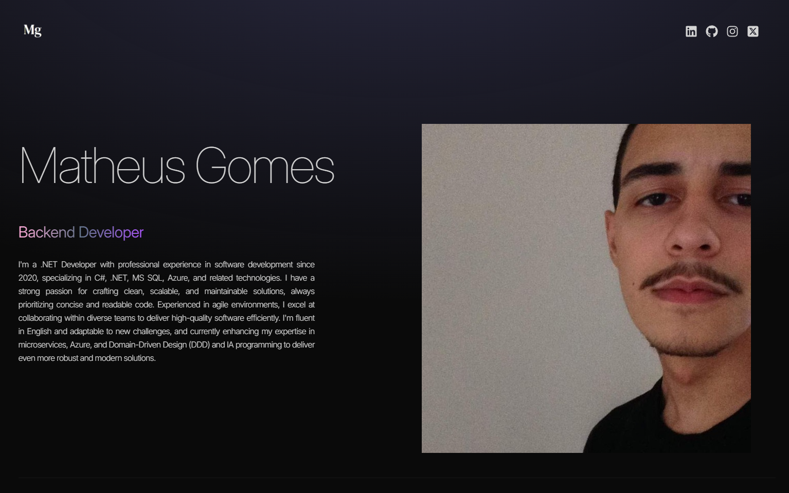

# Portfolio — Personal Website

Personal portfolio application built with React 18 + TypeScript.  
It presents projects, skills, certifications, contact information, and professional experience with bilingual support (`pt` and `en`).

## Live Demo

- [Visit My Portfolio](https://portfolio-matheus-miranda-torres-gomes-projects.vercel.app/)



## Design System

The visual design system is documented in **`DESIGN.md`** at the repository root. This is the canonical reference for:

- Color tokens (OKLCH values, semantic roles, CSS variables)
- Typography (Cormorant Garamond headings, Manrope body, exact sizes and weights)
- Component specifications (buttons, cards, navbar, tags — exact CSS values)
- Layout principles, spacing, grid patterns, and border radius scale
- Shadow/elevation levels and frosted-glass conventions
- Responsive breakpoints and collapsing strategy
- Do's and Don'ts guardrails for consistent UI

**Any UI change should reference `DESIGN.md` to stay consistent with the established design language.**

## Prerequisites

- Node.js 20+
- npm 10+

## Local Setup

1. Install dependencies:

   ```bash
   npm install
   ```

2. Run development server:

   ```bash
   npm run dev
   ```

3. Open Vite local URL (default `http://localhost:5173`).

## VS Code Debugging

This repo includes a VS Code browser debugging setup for the Vite dev server.

1. Open the repository root in VS Code.
2. Go to `Run and Debug`.
3. Select `Debug Portfolio (Chrome)` or `Debug Portfolio (Edge)`.
4. Start debugging with `F5`.

VS Code will start `npm run dev`, wait for Vite to come up on port `5173`, and open a Chrome debug session with source maps enabled for the React/TypeScript app.

If you already started Chrome manually with remote debugging enabled, use `Attach Chrome To Portfolio` instead.

## Build & Test Commands

```bash
# Build (TypeScript check + Vite)
npm run build

# Run Storybook locally
npm run storybook

# Build static Storybook site
npm run build-storybook

# Generate skeleton bones once
npm run bones:build

# Re-capture bones while developing (CLI mode)
npm run bones:watch

# Lint
npm run lint

# Preview production build
npm run preview

# Integration tests (Vitest)
npm run test:integration

# Accessibility scans (Playwright + axe-core)
npm run test:a11y

# Full Phase 3 verification
npm run verify:phase3
```

## Storybook

This repo includes Storybook for isolated component development and documentation.

```bash
# Start Storybook on http://localhost:6006
npm run storybook

# Build the static Storybook output into storybook-static/
npm run build-storybook
```

Stories cover UI primitives (`src/components/ui/`), section components (`src/components/sections/`), and page-level sections (`src/components/`).

## Boneyard Skeletons

This project is integrated with `boneyard-js` for generated skeleton loading states.

- Runtime import is loaded once at startup via `src/bones/registry.ts`.
- `Skeleton` is used in `src/LangRouter.tsx` during language-route readiness.
- Vite plugin (`boneyardPlugin()`) is enabled in `vite.config.ts` for automatic capture on dev server/HMR.
- Optional CLI config lives in `boneyard.config.json`.

## Release Readiness

Final sign-off instructions and evidence placeholders are tracked in:

- `.planning/phases/04-final-polish-and-release-readiness/RELEASE-CHECKLIST.md`

Verification command suite:

```bash
npm run lint
npm run build
npm run test:integration
npm run test:a11y
```

## Build Baseline Recovery

Use this deterministic recovery flow if local dependencies drift or build checks fail:

```bash
rm -rf node_modules package-lock.json
npm install
npm run verify:baseline
```

## Technology Stack

- **Framework:** React 18
- **Language:** TypeScript
- **Build Tool:** Vite
- **Styling:** TailwindCSS + shadcn/ui (radix-vega style)
- **Routing:** React Router
- **Localization:** i18next + react-i18next (`en` and `pt`)
- **Animation:** Framer Motion (`motion/react`)
- **Icons:** Lucide React + react-icons (brands)
- **State Utilities:** CVA (class-variance-authority), clsx + tailwind-merge
- **Component Primitives:** Radix UI
- **Skeleton Loading:** boneyard-js
- **Testing:** Vitest (integration), Playwright + axe-core (a11y)
- **Storybook:** v10 with addon-a11y and addon-docs
- **Deployment:** Vercel

## Repository Structure

| Path | Purpose |
|---|---|
| `DESIGN.md` | Canonical design system — colors, typography, components, layout rules |
| `src/components/` | Page sections (Hero, About, Experience, Projects, Skills, Technologies, Certifications, Contact, Navbar, LanguageSwitcher, Tag) |
| `src/components/ui/` | Reusable UI primitives (Button, NavigationMenu, Sheet) — shadcn/ui |
| `src/components/sections/` | Shared section layout primitives (SectionCard, SectionHeader, SectionShell) |
| `src/models/` | Typed content models (`Project`, `SkillSet`, `ExperienceItem`, `Certification`, `ContactInfo`, `Languages`) |
| `src/locales/` | Translation dictionaries (`en/` and `pt/`) |
| `src/assets/` | Images for profile, projects, and certifications |
| `src/constants/` | Shared constants and static labels |
| `src/bones/` | Boneyard skeleton registry and generated bones |
| `tests/` | Integration tests (`tests/integration/`) and a11y scans (`tests/a11y/`) |
| `.planning/codebase/` | Architecture, structure, conventions, stack, and testing docs |
| `public/` | Public static assets |

## Content Update Guide

- Edit text content in `src/locales/en/translation.json` and `src/locales/pt/translation.json`.
- Keep translation keys synchronized across both locale files.
- Update images in `src/assets/` and keep component references consistent.
- Update model-driven content in `src/models/` when adding projects, skills, or certifications.

## Contribution Notes

- Keep changes aligned with current folder organization.
- Prefer small, focused pull requests.
- Validate with `npm run lint` and `npm run build` before opening a PR.
- Any visual changes should respect the design system in `DESIGN.md`.
